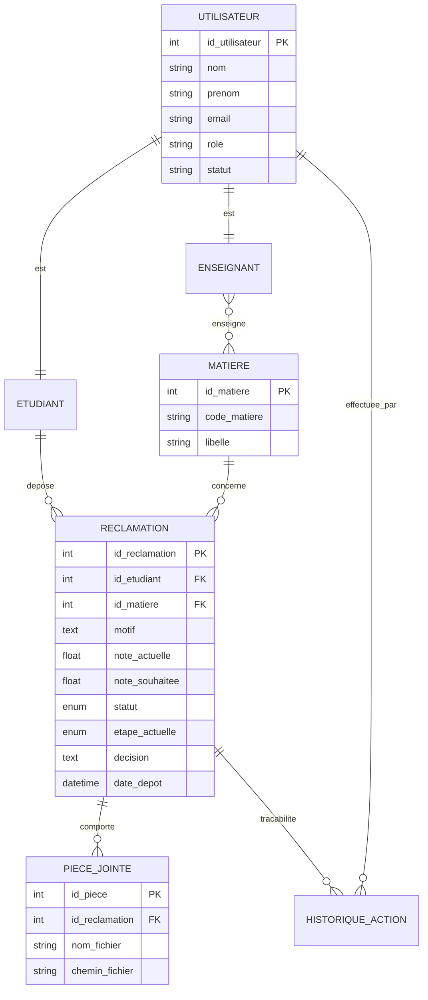
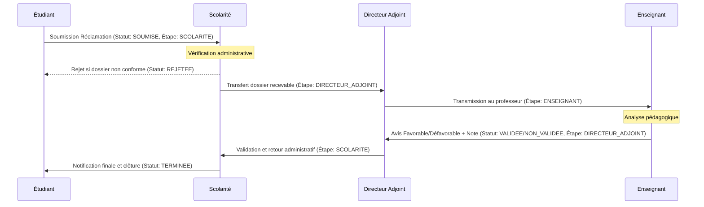
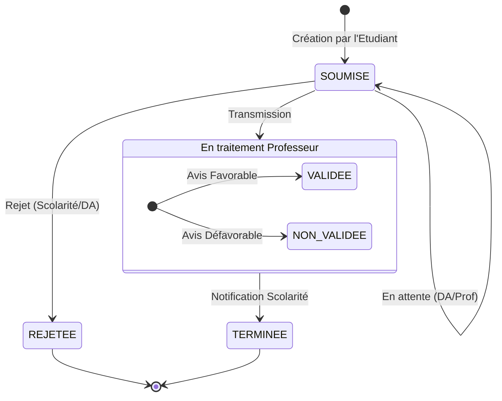

# Conception du Système - IBAM Réclamations

Ce document présente une vue d'ensemble complète de la conception du système de gestion des réclamations à l'IBAM.

---

## 1. Les Acteurs du Système

Le système repose sur quatre acteurs principaux avec des responsabilités bien définies dans le workflow :

* **Étudiant** :
  * Soumet ses réclamations via un formulaire (avec justificatifs multiples).
  * Suit l'évolution de ses demandes en temps réel.
  * Consulte la décision finale et sa nouvelle note le cas échéant.

* **Scolarité** :
  * **Premier point d'entrée** : Vérifie la recevabilité administrative (lisibilité des fichiers, respect des délais).
  * Transmet les dossiers valides au Directeur Adjoint ou rejette les dossiers non recevables.
  * **Dernier point de sortie** : Reçoit l'avis final validé et clôture le dossier après avoir notifié l'étudiant.

* **Directeur Adjoint (DA)** :
  * Supervise le flux entre l'administration et le corps enseignant.
  * Transmet les dossiers reçus de la scolarité aux enseignants concernés.
  * Valide le retour (avis favorable ou défavorable) des enseignants et retransmet à la scolarité pour finalisation.

* **Enseignant** :
  * Analyse le fond de la réclamation pédagogique pour les matières qui lui sont attribuées.
  * Donne un avis (Favorable ou Défavorable).
  * Saisit la note corrigée en cas d'erreur de notation constatée.

---

## 2. Diagramme de Cas d'Utilisation

Ce diagramme illustre les interactions des acteurs avec les fonctionnalités du système.

```mermaid
usecaseDiagram
    actor Étudiant
    actor Scolarité
    actor "Directeur Adjoint" as DA
    actor Enseignant

    package "IBAM - Système de Réclamations" {
        usecase "Authentification (INE ou Email)" as UC0
        usecase "Soumettre une Réclamation (Multiple Upload)" as UC1
        usecase "Suivre le statut de sa demande" as UC2
        usecase "Vérifier la recevabilité du dossier" as UC3
        usecase "Transmettre à l'Enseignant" as UC4
        usecase "Donner un avis (Favorable/Défavorable)" as UC5
        usecase "Ajuster la note" as UC6
        usecase "Valider le retour Enseignant" as UC7
        usecase "Clôturer et Notifier l'étudiant" as UC8
        usecase "Consulter l'historique complet" as UC9
    }

    Étudiant --> UC0
    Étudiant --> UC1
    Étudiant --> UC2
    
    Scolarité --> UC0
    Scolarité --> UC3
    Scolarité --> UC8
    Scolarité --> UC9
    
    DA --> UC0
    DA --> UC4
    DA --> UC7
    DA --> UC9
    
    Enseignant --> UC0
    Enseignant --> UC5
    Enseignant --> UC6
```

---

## 3. Diagramme de Classes (Modèle de Données)

Ce schéma représente la structure des données et les relations entre les entités.



---

## 4. Diagramme de Séquence (Workflow Global)

Le diagramme ci-dessous décrit le flux dynamique d'une réclamation.



---

## 5. Diagramme d'État de la Réclamation

Les différents états par lesquels passe une réclamation au cours de son cycle de vie.



---

## 6. Architecture Technique

### Back-end

* **Framework** : Laravel 11.x
* **Langage** : PHP 8.2+
* **Base de données** : MySQL 8.0
* **Sécurité** : Laravel Sanctum pour l'authentification API

### Front-end

* **Framework** : React 18
* **Styling** : Tailwind CSS
* **Routing** : React Router DOM v6
* **Gestion d'état** : React Context API (AuthContext)

### API Endpoints

* `POST /api/login` : Authentification (identifiant + password).
* `GET /api/claims` : Liste des réclamations filtrées selon le rôle de l'utilisateur connecté.
* `GET /api/claims/{id}` : Détails d'une réclamation avec son historique et ses pièces jointes.
* `POST /api/claims` : Soumission d'une nouvelle réclamation (données + fichiers).
* `PUT /api/claims/{id}` : Action de workflow (Scolarité, DA, Enseignant).
* `GET /api/subjects` : Liste des matières pour le formulaire de soumission.

---

## 7. Sécurité et Contraintes

### Sécurité

* **Authentification** : Gestion des sessions via Laravel Sanctum.
* **Autorisation** : Middlewares basés sur les rôles (Gates/Policies) pour restreindre l'accès au workflow.
* **Validation** : Validation stricte des types de fichiers (PDF/Images) et de la taille (max 5Mo par fichier).
* **Protection** : Protection contre les injections SQL via l'ORM Eloquent et Query Builder.

### Contraintes Non-Fonctionnelles

* **Performance** : Temps de réponse < 500ms pour les listes.
* **Disponibilité** : Système accessible 24h/24 pour la soumission.
* **Ergonomie** : Interface responsive (Tablettes/Laptops).

---

## 8. Dictionnaire de Données (Extraits)

### Reclamation

| Champ | Type | Description |
| :--- | :--- | :--- |
| id_reclamation | BigInt | Identifiant unique (PK) |
| id_etudiant | BigInt | Référence vers l'étudiant (FK) |
| id_matiere | BigInt | Référence vers la matière concernée (FK) |
| motif | Text | Texte explicatif de la réclamation |
| note_actuelle | Decimal | Note obtenue initialement |
| note_souhaitee | Decimal | Note espérée par l'étudiant |
| statut | Enum | État global (SOUMISE, VALIDEE, NON_VALIDEE, TERMINEE, REJETEE) |
| etape_actuelle | Enum | Acteur devant traiter (SCOLARITE, DIRECTEUR_ADJOINT, ENSEIGNANT) |

---

## 9. Détails des Cas d'Utilisation Critiques

### UC1: Soumettre une Réclamation

* **Acteur principal** : Étudiant
* **Précondition** : Étudiant authentifié.
* **Scénario nominal** :
  1. L'étudiant sélectionne la matière concernée.
  2. Il saisit sa note actuelle et son motif.
  3. Il télécharge ses pièces jointes (fichiers notes, anonymat, etc.).
  4. Le système enregistre la demande et notifie l'étape suivante (Scolarité).
* **Postcondition** : Statut = `SOUMISE`, Étape = `SCOLARITE`.

### UC3: Vérifier la recevabilité

* **Acteur principal** : Agent de Scolarité
* **Scénario nominal** :
  1. L'agent consulte la liste des nouvelles réclamations.
  2. Il ouvre le dossier et vérifie les pièces jointes.
  3. Il valide le dossier comme "Recevable".
* **Postcondition** : Étape = `DIRECTEUR_ADJOINT`.

### UC5: Evaluation Enseignant

* **Acteur principal** : Enseignant
* **Scénario nominal** :
  1. L'enseignant reçoit les réclamations de ses matières.
  2. Il saisit son avis (Favorable/Défavorable).
  3. S'il est favorable, il saisit la note corrigée.
* **Postcondition** : Statut = `VALIDEE` (si favorable), Étape = `DIRECTEUR_ADJOINT`.
